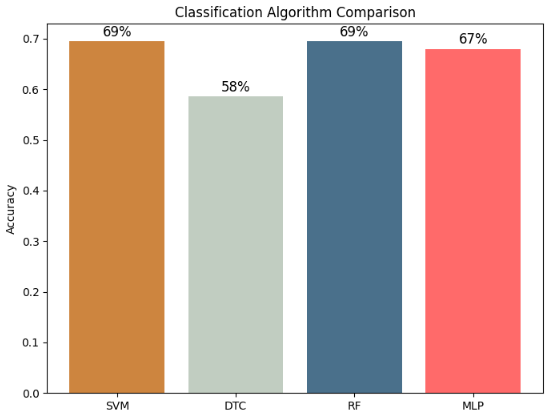
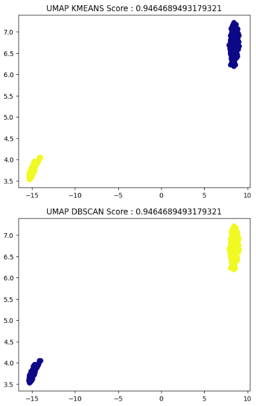
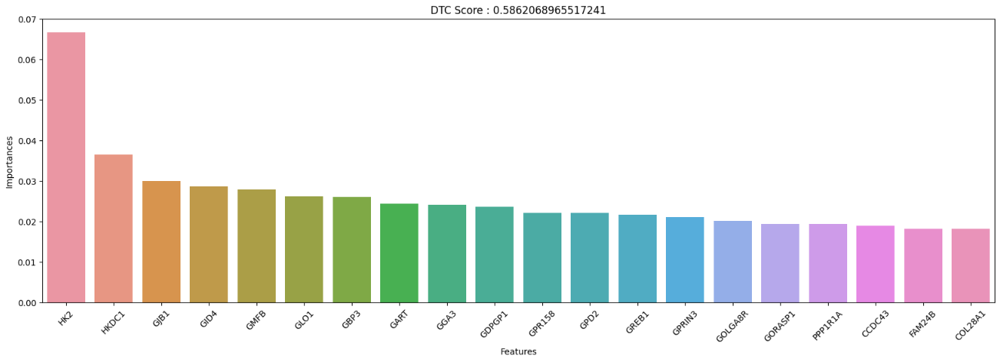

# Alzheimer's Disease Prediction with Machine Learning

This project aims to predict Alzheimer's disease using genetic sequence data.
The dataset "alzheimer_gs" contains genetic sequence information, likely to be
genetic nucleotide sequences or features related to these sequences (e.g. mutations,
variations, etc.), and the performance of models trained using different ML
algorithms is measured.

## Dataset

The "alzheimer_gs" dataset contains genetic sequence data related to Alzheimer's
disease.

## Models

This project was created to evaluate the performance of different machine learning
algorithms on the dataset. The performance of the trained models is evaluated using
accuracy.

#### The algorithms used for classification are:

- Random Forest
- Support Vector Machines (SVM)
- Decision Tree
- Multi Layer Perceptron (MLP)

### The algorithms used for clustering are:

- KMEANS
- DBSCAN

### The algorithms used for dimension reduction and feature selection are:

- UMAP
- PCA
- Backward Selection
- Forward Selection

### The algorithms used for hyper-parameters selection are:

- GridSearch
- RandomSearch

## Installation
This project was developed using the Python programming language. To use this project,
you need to install the following libraries:

- numpy
- pandas
- scikit-learn
- matplotlib
- seaborn
- umap

## Results

##### [Results of classification models](results/classification_models_results.PNG)

##### [Results of Clustering models](results/clustering_models_results.PNG)

##### [Most Important Features (20)](results/MostImportant20Feature.PNG)

These features were selected from the previous Decision Tree Classifier model to train a
different model. However, these 20 features, chosen with a simple logic, caused a decrease
in the performance of the DTC model.

